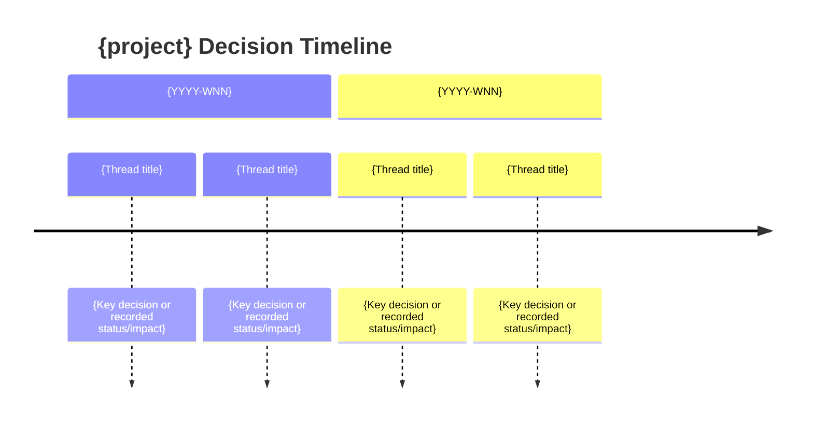

# Decision Roadmap Generator

Reads accumulated raw entries from the knowledge vault and synthesizes them into a narrative decision roadmap — a document organized by decision threads rather than time periods. Each thread tells the story of a key decision: what triggered it, what was explored, what was chosen, what was abandoned, whether those abandonments still make sense, and which decisions were revised or superseded.

Unlike weekly/monthly reports (organized by calendar period) or git history (organized by code changes), the decision roadmap is organized by **decision threads** — chains of related entries that reveal how a project's thinking evolved.

## Effective Facts

Use the bundled helper's effective facts, correction_history, states and
diagnostics. `--as-of` selects an explicit knowledge cutoff; `--end` bounds
lifecycle state by work date. Query/Roadmap also accept `--start`. Do not restore
retracted facts or close questions from similar wording. Accepted risks remain
separate from mitigated risks. Missing captured_at limits exact as-of replay.
Old reports are not rewritten; refresh a requested report through its writer.

## Workflow

### Step 0: Resolve Config and Scope

Default scope is the current project across all available weeks. Start once:

```bash
python <this-skill>/scripts/decision_graph.py roadmap --cwd "$PWD" --limit-threads 20
```

This resolves config and loads/rebuilds the derived index as needed. Use the
pack's thread decisions, source_entry_refs and boundaries directly; do not run
an extra build or reload all raw by default. Raw remains the source of truth.
Check diagnostics and compare `thread_count` to `len(threads)`. If truncated,
rerun with `--limit-threads <thread_count>` before a complete roadmap; if unable
to complete, label the output partial with included/total threads. Missing-source
diagnostics remain explicit and must not be described as complete live coverage.
Read cited raw only when a detail needed for judgment is absent from the pack.
Artifact links are navigation, never independent decision facts.

For an explicit date range, use the same roadmap helper with `--start` and
`--end`, and `--as-of` only when requested. For cross-project requests, call it
once per authorized project with `--slug`; keep identities distinct and check
each pack's coverage. Do not bypass the effective view by loading old raw facts.
If config or entries are missing, return the evidence gap in conversation;
cold-start is an optional storage upgrade, not a reason to fabricate a roadmap.

### Step 1: Use Scoped Evidence

Default: the complete evidence pack above. Explicit date/cross-project branches: the corresponding scoped packs.
Optional `{vault}/raw/artifacts/{slug}.json` provides recorded scope/navigation.

### Step 2: Assess Decision Signal Strength

Every entry contributes to the roadmap, but with different signal strength. Classify each entry:

**Strong signal** — entries with explicit decision-recording fields:
- `motivation` is present and non-empty
- `exploration_paths` is present and non-empty
- `abandoned_alternatives` is present and non-empty
- `open_questions` is present and non-empty
- `type` is `decision`

These entries directly state why something was done, what was tried, and what was rejected. Use their decision fields verbatim.

**Medium signal** — entries without decision-recording fields, but with rich `summary` and `context` that reveal decision logic. These are the most common case in real vaults — many projects have entries written before the decision-recording schema was introduced. **Infer decision signals** from:

- `summary` describes what was built/changed → infer **motivation** from the "why" implicit in `context`
- `context` explains why it was needed → extract the **trigger** and only the recorded status or effect; do not promote an expected effect into an observed outcome
- `type` indicates the nature of the change → `feature` = new capability chosen, `fix` = problem-driven decision, `refactor` = structural decision, `risk` = identified concern
- `impact` field (when present) → recorded impact claim, preserving whether it is observed, expected, ongoing, or evidence-limited

Inference examples:
- summary: "Added retry-with-repair loop to validation" + context: "Single-pass missed 3 failure patterns" → motivation: "Validation accuracy insufficient for production", exploration: ["single-pass → rejected (missed patterns)", "retry-with-repair → chosen"]
- summary: "Switched from batch to per-episode rolling execution" + context: "Batch processing failed on long scripts" → motivation: "Batch mode couldn't handle script length variance", abandoned: ["batch processing for all episodes at once"]

**Weak signal** — entries with terse summary/context that only describe what changed without explaining why. These establish what was built. Use them as timeline markers and background context within threads, but don't force them into decision points.

**Signal density check**: After classification, if fewer than 30% of entries are strong-signal, the roadmap will rely heavily on inference. Note this in the document header: "Decision context inferred from {N}/{M} entries (explicit decision fields present in {N} entries)."

### Step 2.5: Data Integrity Constraint

The roadmap must be derived from raw entries only. Do not:
- Supplement with git history, commit logs, or external documents
- Invent entries, timestamps, commit hashes, or technical details not present in the source data
- Fabricate exploration paths or abandoned alternatives that aren't supported by the entries

If the raw entries are insufficient to build a meaningful thread, say so rather than filling gaps with invented content. A thin roadmap built from real data is more valuable than a rich roadmap built from assumptions.

### Step 3: Identify Decision Threads

Group entries into **decision threads**. A thread connects entries that share a common theme, regardless of signal strength:

- Same technical area (same module, component, or architectural concern mentioned in `summary` or `context`)
- Exploration paths that reference each other's recorded results or status
- Motivations that build on each other (later entry resolves earlier entry's `open_questions`)
- Entries that describe successive iterations on the same problem

Strong-signal entries anchor each thread with explicit decision context. Medium-signal entries fill the timeline with inferred decision points. Weak-signal entries provide chronological context — what was built when, establishing the background against which decisions were made.

For each thread, extract:

| Element | Source |
|---------|--------|
| Title | Capture the core decision area in 3-6 words |
| Timeline | First to last entry timestamp |
| Trigger | Original `motivation` (strong signal) or inferred from earliest entry's `context` (medium signal) |
| Decision points | Key moments where a choice was made — from explicit exploration paths (strong) or from contrasting "what was" vs "what changed" (medium) |
| Exploration paths | From `exploration_paths` field (strong) or inferred from before/after in `summary`+`context` (medium) |
| Abandoned alternatives | From `abandoned_alternatives` field (strong) or from `context` describing rejected approaches (medium) |
| Current status | Resolved / Ongoing / Has open questions |
| Confidence | `explicit` when sourced from decision fields; `inferred` when reconstructed from summary/context |
| Evidence | Raw entry timestamp/reference plus available `evidence_refs`, `source_refs`, or source-of-truth artifact references; general artifact refs remain navigation |

### Cross-Referencing Artifact Dossiers

When the artifact dossier index exists at `{vault}/raw/artifacts/{slug}.json`:

1. For each identified decision thread, check if any artifact dossier entries
   carry `decision_threads` that match.
2. When an artifact links to a thread, include its `title`, `path`, `topics`,
   `artifact_summary.scope`, `source_availability`, and `last_seen` in the
   thread's supporting navigation or recorded-context notes.
3. Artifacts with `status: superseded` or `superseded_by` may indicate decisions
   that have been revisited — flag these for the "Roadmap Correction" section.
4. Do not create threads from artifact metadata alone. Artifacts can connect
   threads but cannot define them.
5. Treat `artifact_summary.key_claims` as `navigation_only` or
   `recorded_context` unless the claim or linked raw entry carries direct
   evidence.

### Thread Merge Suggestions

When the derived Decision Replay Index contains `thread_merge_suggestions` in its
`source` block, review them before writing thread narratives. These are
heuristically detected similar thread slugs that may represent the same decision
domain. The agent should:

1. Read the entries behind both threads
2. Confirm whether they are genuinely the same domain
3. Present the merge suggestion to the user
4. After confirmation, use the `suggested_merge` slug in the roadmap narrative

Do not auto-merge threads without confirmation. If the evidence is ambiguous,
keep the threads separate and note the possible relationship.

Also track lifecycle-like signals when entries explicitly support them:

- revised decisions
- superseded decisions
- abandoned alternatives worth revisiting
- stale open questions
- accumulating risks
- recurring open questions

Use only supported threads; one is enough. Never merge loosely related threads
to meet a count. Preserve complete coverage or explicitly label partial output.

**Mark inferred content**: When decision points, exploration paths, or abandoned alternatives are inferred rather than directly sourced from entry fields, express them with hedging language ("likely motivated by", "appears the approach shifted from X to Y") rather than presenting inference as fact.

### Step 4: Write the Roadmap

Use the scoped evidence already collected. Do not run another index build or
reconstruct pack links manually. Retain confidence, evidence_boundary,
impact_boundary, source refs and diagnostics through the narrative.

Generate a Markdown document with this structure:

```markdown
# Decision Roadmap — {project name}

> Generated {date} from {N} entries spanning {first-week} to {last-week}.
> {N} decision threads identified.
> Decision context: {N_strong} entries with explicit decision fields, {N_medium} inferred from summary/context, {N_weak} as background.

---

## Decision Timeline



---

## Thread: {Thread Title}

**Timeline**: {first-date} → {last-date}
**Status**: Resolved | Ongoing | Open questions remaining

{2-4 sentence narrative: what triggered this thread, what was explored, what was chosen, and why. Write as a story, not a bullet list.}

### Decision Points

| Date | Decision | Trigger | Recorded Status / Impact | Confidence | Evidence |
|------|----------|---------|--------------------------|------------|----------|
| {date} | {what was decided} | {what prompted it} | {status or impact exactly as supported; say “not recorded” when absent} | explicit / inferred | {source entry timestamp/id plus evidence refs} |

### Exploration Paths

```mermaid
flowchart LR
    A[{Trigger}] --> B{Decision point}
    B -->|{Option 1}| C[{Recorded result or status}]
    B -->|{Option 2}| D[{Recorded result or status}]
    D -->|Rejected| E[{Reason}]
    C --> F[{Follow-up status}]
```

| Approach | Recorded Status / Result | Why | Confidence | Evidence |
|----------|--------------------------|-----|------------|----------|
| {approach} | {chosen / rejected / deferred / observed result} | {reason} | explicit / inferred | {source timestamp/id and available refs} |

### Abandoned Alternatives

- **{Alternative name}** — {why it was rejected}. {Any conditions under which it should be reconsidered.}

### Open Questions

- {Question from open_questions field, or inferred from the thread}

---

{Repeat for each thread}

---

## Reassessment of Abandoned Alternatives

For each abandoned alternative across all threads, reassess with current knowledge:

| Alternative | When | Original Reason | Still Valid? | Revisit Trigger |
|-------------|------|----------------|--------------|-----------------|
| {name} | {date} | {why abandoned} | Yes / Partially / No | {what would make it worth reconsidering} |

## Roadmap Correction

Use this section when current evidence suggests a prior abandonment, decision,
or open question should be revisited. Every correction must cite raw-entry
evidence and label inferred conclusions.

## Accumulating Risks

List risks that appear across multiple entries, remain unresolved, or become
more consequential over time. Each item must cite source timestamps and say
whether the risk is explicit or inferred.

| Risk | Evidence | Current Pressure | Suggested Review |
|------|----------|------------------|------------------|
| {risk} | {timestamps} | low / medium / high | {what to inspect next} |

## Recurring Open Questions

Group repeated or long-lived open questions by decision thread. Omit this section
if there are no supported recurring questions.

| Question | First Seen | Repeated In | Why It Matters |
|----------|------------|-------------|----------------|
| {question} | {timestamp} | {timestamps} | {planning or architecture impact} |

---

## Open Questions Inventory

All unresolved questions across threads, organized by urgency:

### Active (needs resolution soon)
- {question} — from {thread}, open since {date}

### Deferred (no immediate pressure)
- {question} — from {thread}, open since {date}

### Resolved since last roadmap
- ~~{question}~~ — resolved in {entry summary}
```

### Writing Guidelines

**Narrative tone**: Write as a colleague explaining the project's journey to someone who wasn't there. Second person is fine ("we explored", "we chose"). Be specific about technical details — vague abstractions defeat the purpose.

**Decision points table**: Each row should be a meaningful fork in the road, not every entry. Ask: "did this change the project's direction?" If yes, it's a decision point.
Use the raw entry's recorded `status` and `impact`; if neither records what
happened afterward, write "not recorded" rather than inventing an outcome. Every
row must expose confidence and evidence. `source_entry_refs` establish provenance;
`evidence_refs`, `source_refs`, and source-of-truth artifact references provide
additional verification paths when present. General artifact refs remain
navigation hints.

**Mermaid diagrams**:
- Use `timeline` for the overview — one entry per thread per week where something happened
- Use `flowchart LR` for exploration paths within a thread — show the branching and where each path led
- Keep diagrams readable: max 8-10 nodes per flowchart. If a thread has more decision points, split into sub-diagrams.
- For inferred exploration paths (not from explicit `exploration_paths` field), use dashed-style arrows or add "?" to the node label to distinguish inference from explicit data

**Reassessment**: This is the highest-value section. For each abandoned alternative, honestly evaluate whether the original rejection reason still holds. The goal is to surface forgotten viable approaches — that's the Phase 3 validation criterion. When alternatives were inferred rather than explicitly recorded, note this: "Inferred alternative — original rejection reason reconstructed from context."

**Roadmap correction**: Include revised/superseded decisions and alternatives
worth revisiting. Do not invent corrections from artifact titles alone; artifact
index is source navigation only.

**Accumulating risks and recurring questions**: This absorbs the useful part of
hard-stuff radar. Only include a risk or question when supported by raw entries.
Use "inferred" language when grouping is based on similarity rather than an
explicit repeated label.

**Inference transparency**: The roadmap mixes explicit decision data with inferred signals. Readers need to know which is which. Use these conventions:
- Decision points from explicit fields: stated as fact
- Decision points inferred from summary/context: "appears to have been motivated by..." or "likely driven by..."
- Exploration paths from explicit fields: stated as fact
- Exploration paths inferred from before/after: "the approach evolved from X to Y, suggesting..."
- Recorded impact is not automatically verified impact. Preserve words such as
  "expected", "enabled", "ongoing", or "risk" from the source, and identify an
  evidence gap when no result evidence is recorded.

### Step 5: Output

Save the roadmap to the vault:

```
{vault}/Work Diary/Decision Roadmap.md
```

If scoped to a date range:

```
{vault}/Work Diary/Decision Roadmap - {start} to {end}.md
```

If the vault path cannot be resolved, output the roadmap directly to the conversation and tell the user to run `/tracework:cold-start-interview` for persistent roadmap memory.

This skill does **not** write a raw entry side effect. The decision roadmap is a reading/synthesis activity — it consumes entries, it doesn't produce new decision signals. The roadmap itself is the deliverable.
The Decision Replay Index is a derived raw-layer index, not a new historical
raw entry.

## Configuration

Uses the unified Tracework configuration system. Same resolution order as other skills:

| Priority | Location | Scope |
|----------|----------|-------|
| 1 | `.tracework/config.yaml` (project root) | Project-level override |
| 2 | `~/.tracework/config.yaml` | Global default |

## Shared Storage Convention

The skill reads raw entries following the schema in `references/tracework-storage-convention.md`.
It produces a Markdown document in the vault's wiki layer and may refresh
`{vault}/raw/decisions/{slug}.json` as a derived decision replay index. It does
not write new historical raw entries.
